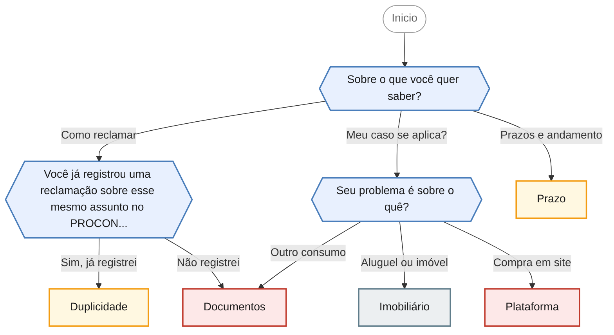

<!-- gerado por scripts/gerar_diagramas.py -->

## Como funciona o atendimento do PROCON

`atendimento-procon` · Informações sobre abertura de reclamação, documentos exigidos, prazos de resposta e limites de atuação do PROCON.

**3 perguntas · 5 orientacoes finais** · Fonte: Dúvidas Frequentes PROCON Jacareí — casos 7, 8, 26, 27 e 47

Desfechos: Encaminha para agendamento presencial, Fora da competencia do PROCON, Apenas orienta.

O que cada desfecho responde

| Nó | Início da orientação | Encaminhamento |
|---|---|---|
| `orienta_documentos` | Cada caso exige uma análise própria, mas três documentos são sempre essenciais para abrir uma reclamação: o seu documento pessoal, o CNPJ da matriz do fornecedor e os comprovantes do problema. | Encaminha para agendamento presencial |
| `orienta_prazo` | Funciona assim: depois que a reclamação é aberta, chamada de CIP, o fornecedor tem até 10 dias corridos para apresentar a resposta no sistema. | Apenas orienta |
| `orienta_duplicidade` | Nesse caso não é possível abrir uma nova reclamação no posto de atendimento, porque não podemos registrar reclamações em duplicidade sobre o mesmo assunto. | Apenas orienta |
| `orienta_plataforma` | Sim, vale acionar os dois. | Encaminha para agendamento presencial |
| `orienta_imobiliario` | Preciso ser transparente: casos de direito imobiliário, como locação de imóveis, não são regidos pelo Código de Defesa do Consumidor. | Fora da competencia do PROCON |

