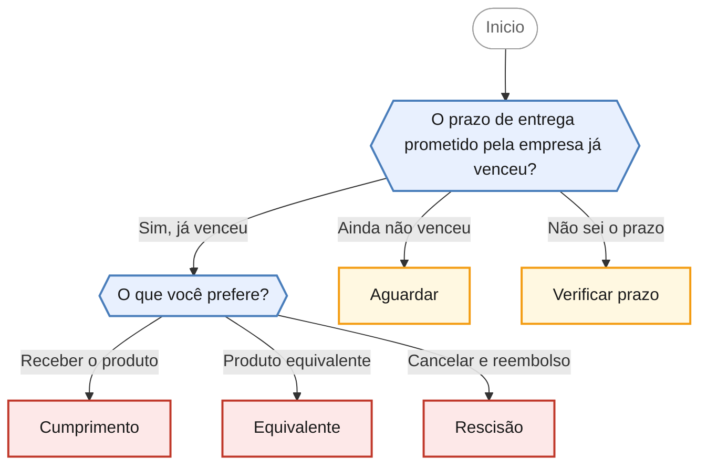

<!-- gerado por scripts/gerar_diagramas.py -->

## O produto não foi entregue no prazo

`atraso-entrega` · Fornecedor descumpre o prazo de entrega prometido. Consumidor escolhe entre cumprimento, produto equivalente ou rescisão.

**2 perguntas · 5 orientacoes finais** · Fonte: Dúvidas Frequentes PROCON Jacareí — caso 15

Desfechos: Encaminha para agendamento presencial, Apenas orienta.

O que cada desfecho responde

| Nó | Início da orientação | Encaminhamento |
|---|---|---|
| `orienta_cumprimento` | Você optou por exigir a entrega do produto que comprou. | Encaminha para agendamento presencial |
| `orienta_equivalente` | Você optou por aceitar outro produto ou serviço equivalente no lugar do que foi comprado. | Encaminha para agendamento presencial |
| `orienta_rescisao` | Você optou por cancelar a compra e receber o dinheiro de volta. | Encaminha para agendamento presencial |
| `orienta_aguardar` | Como o prazo prometido ainda não venceu, por ora não há descumprimento por parte da empresa e não é possível abrir uma reclamação por atraso. | Apenas orienta |
| `orienta_verificar_prazo` | Para saber se houve descumprimento, primeiro é preciso identificar qual prazo foi prometido. | Apenas orienta |

