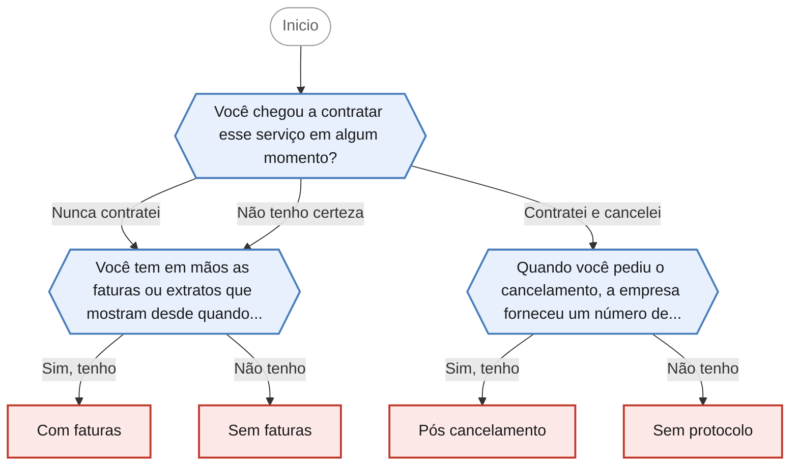

<!-- gerado por scripts/gerar_diagramas.py -->

## Cobrança de serviço que eu não contratei

`cobranca-servico-nao-contratado` · Cobrança recorrente de serviço não contratado ou já cancelado, geralmente em fatura de cartão de crédito.

**3 perguntas · 4 orientacoes finais** · Fonte: Dúvidas Frequentes PROCON Jacareí — caso 1 (seguro no cartão de crédito)

Desfechos: Encaminha para agendamento presencial.

O que cada desfecho responde

| Nó | Início da orientação | Encaminhamento |
|---|---|---|
| `orienta_com_faturas` | Pelo que você descreveu, trata-se de uma cobrança por serviço não contratado. | Encaminha para agendamento presencial |
| `orienta_sem_faturas` | Pelo que você descreveu, trata-se de uma cobrança por serviço não contratado. | Encaminha para agendamento presencial |
| `orienta_pos_cancelamento` | Se o serviço foi cancelado e a cobrança continuou, os valores descontados depois do cancelamento também são indevidos. | Encaminha para agendamento presencial |
| `orienta_sem_protocolo` | Sem o número de protocolo fica mais difícil provar a data do seu pedido de cancelamento, mas isso não impede a reclamação. | Encaminha para agendamento presencial |

