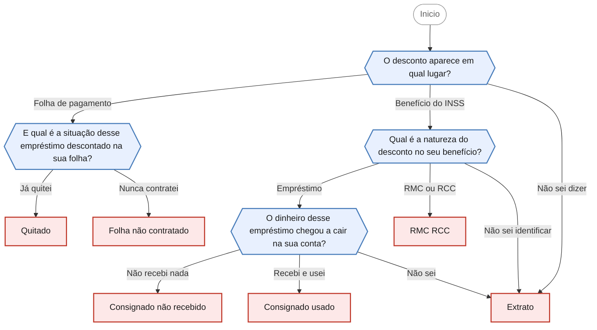

<!-- gerado por scripts/gerar_diagramas.py -->

## Desconto indevido na folha de pagamento ou no benefício

`descontos-folha-beneficio` · Descontos de empréstimo já quitado, empréstimo não contratado ou reserva de margem (RMC/RCC) em folha ou benefício.

**4 perguntas · 6 orientacoes finais** · Fonte: Dúvidas Frequentes PROCON Jacareí — casos 2, 3 e 6

Desfechos: Encaminha para agendamento presencial.

O que cada desfecho responde

| Nó | Início da orientação | Encaminhamento |
|---|---|---|
| `orienta_quitado` | Se o empréstimo já foi quitado, os descontos que continuaram sendo feitos são indevidos. | Encaminha para agendamento presencial |
| `orienta_folha_nao_contratado` | Um empréstimo que você não contratou não pode ser descontado da sua folha. | Encaminha para agendamento presencial |
| `orienta_consignado_nao_recebido` | Se o valor nunca caiu na sua conta e mesmo assim há desconto no benefício, a situação é de empréstimo não reconhecido. | Encaminha para agendamento presencial |
| `orienta_consignado_usado` | Preciso ser transparente com você sobre esse ponto. | Encaminha para agendamento presencial |
| `orienta_rmc_rcc` | RMC e RCC são reservas de margem ligadas a um cartão de crédito consignado. | Encaminha para agendamento presencial |
| `orienta_extrato` | Para orientar você com precisão, primeiro é preciso identificar exatamente qual é o desconto. | Encaminha para agendamento presencial |

