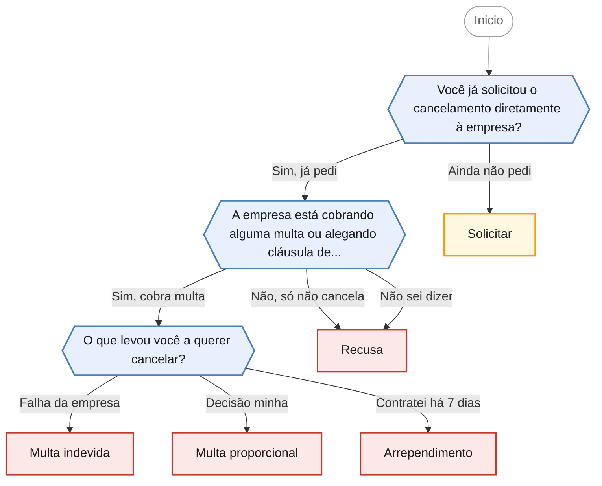

<!-- gerado por scripts/gerar_diagramas.py -->

## Dificuldade para cancelar um serviço

`dificuldade-cancelamento` · Empresa dificulta ou recusa o cancelamento de serviço contratado, com ou sem cobrança de multa por fidelidade.

**3 perguntas · 5 orientacoes finais** · Fonte: Dúvidas Frequentes PROCON Jacareí — casos 5, 9 e 10

Desfechos: Encaminha para agendamento presencial, Apenas orienta.

O que cada desfecho responde

| Nó | Início da orientação | Encaminhamento |
|---|---|---|
| `orienta_solicitar` | Antes de abrir uma reclamação, o primeiro passo é registrar o pedido de cancelamento junto à empresa e guardar a prova disso. | Apenas orienta |
| `orienta_recusa` | A empresa não pode criar obstáculos para o cancelamento de um serviço que você contratou. | Encaminha para agendamento presencial |
| `orienta_multa_indevida` | Quando o cancelamento acontece porque a empresa falhou na prestação do serviço, a cobrança de multa por fidelidade é indevida. | Encaminha para agendamento presencial |
| `orienta_multa_proporcional` | Cláusula de fidelidade é permitida. | Encaminha para agendamento presencial |
| `orienta_arrependimento` | Se você contratou o serviço fora da loja física, por telefone, internet ou com vendedor em casa, e ainda está dentro dos 7 dias, existe um caminho mais simples: o direito de arrependimento. | Encaminha para agendamento presencial |

