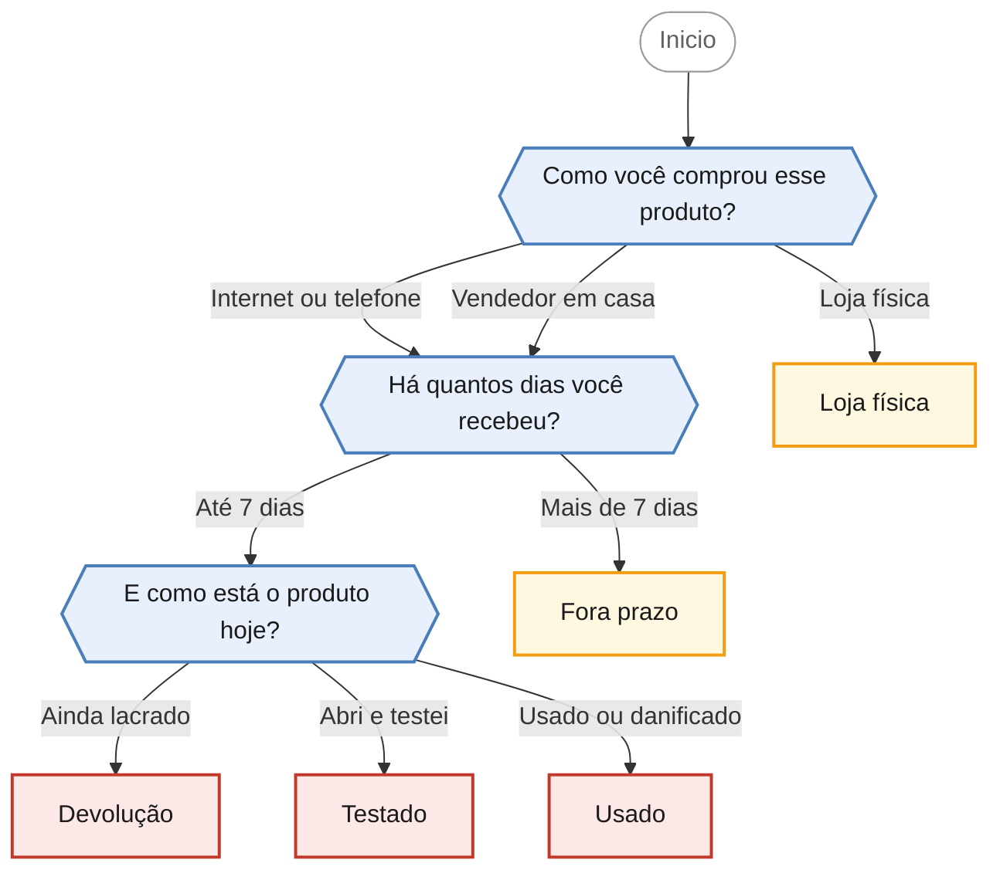

<!-- gerado por scripts/gerar_diagramas.py -->

## Quero devolver uma compra da qual me arrependi

`direito-arrependimento` · Desistência de compra dentro de 7 dias, aplicável a contratações feitas fora do estabelecimento comercial.

**3 perguntas · 5 orientacoes finais** · Fonte: Dúvidas Frequentes PROCON Jacareí — casos 11 a 14, 23 e 43

Desfechos: Encaminha para agendamento presencial, Apenas orienta.

O que cada desfecho responde

| Nó | Início da orientação | Encaminhamento |
|---|---|---|
| `orienta_devolucao` | Você está dentro do prazo e tem direito de desistir da compra. | Encaminha para agendamento presencial |
| `orienta_testado` | Ter aberto a embalagem e testado o produto não elimina o seu direito de desistir. | Encaminha para agendamento presencial |
| `orienta_usado` | Aqui é preciso separar duas coisas. | Encaminha para agendamento presencial |
| `orienta_loja_fisica` | Preciso ser direto com você: o direito de arrependimento não se aplica a compras feitas presencialmente na loja. | Apenas orienta |
| `orienta_fora_prazo` | O prazo de 7 dias para desistir da compra já passou, então o direito de arrependimento não se aplica mais ao seu caso. | Apenas orienta |

