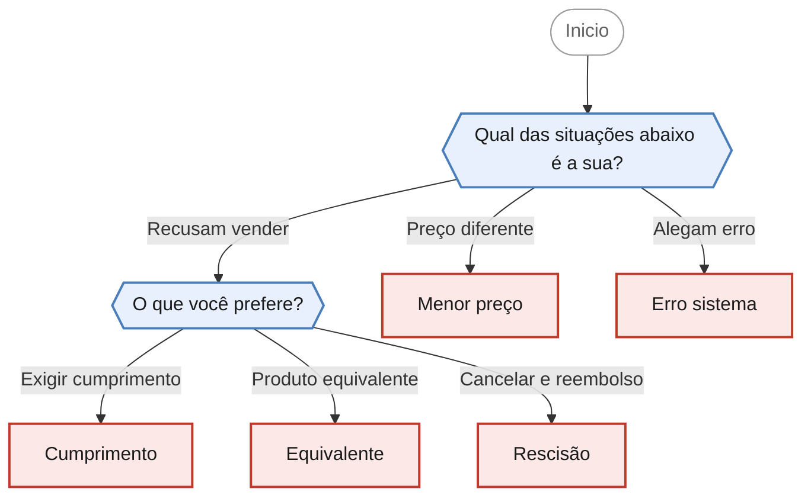

<!-- gerado por scripts/gerar_diagramas.py -->

## Problema com o preço anunciado

`divergencia-preco` · Divergência entre preço anunciado e cobrado, ou recusa da loja em cumprir a oferta divulgada.

**2 perguntas · 5 orientacoes finais** · Fonte: Dúvidas Frequentes PROCON Jacareí — casos 38 a 42

Desfechos: Encaminha para agendamento presencial.

O que cada desfecho responde

| Nó | Início da orientação | Encaminhamento |
|---|---|---|
| `orienta_menor_preco` | Quando há dois preços diferentes para o mesmo produto, vale o menor. | Encaminha para agendamento presencial |
| `orienta_cumprimento` | Você optou por exigir que a loja cumpra a oferta nos termos em que foi anunciada. | Encaminha para agendamento presencial |
| `orienta_equivalente` | Você optou por aceitar outro produto ou serviço equivalente no lugar do que foi anunciado. | Encaminha para agendamento presencial |
| `orienta_rescisao` | Você optou por cancelar a compra e receber o dinheiro de volta. | Encaminha para agendamento presencial |
| `orienta_erro_sistema` | Em regra, não. | Encaminha para agendamento presencial |

