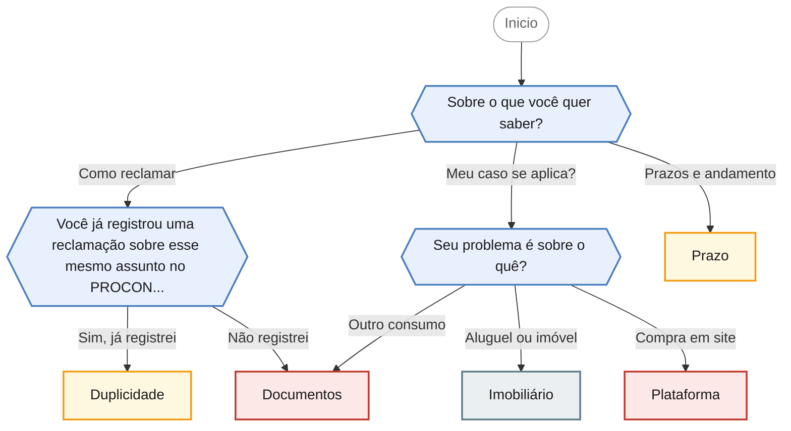
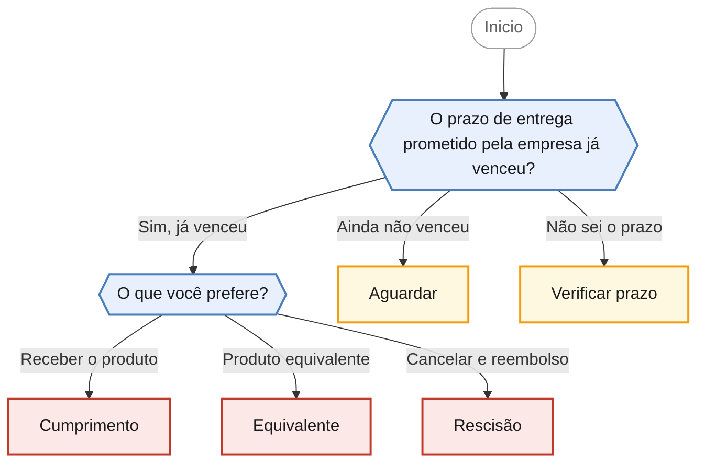
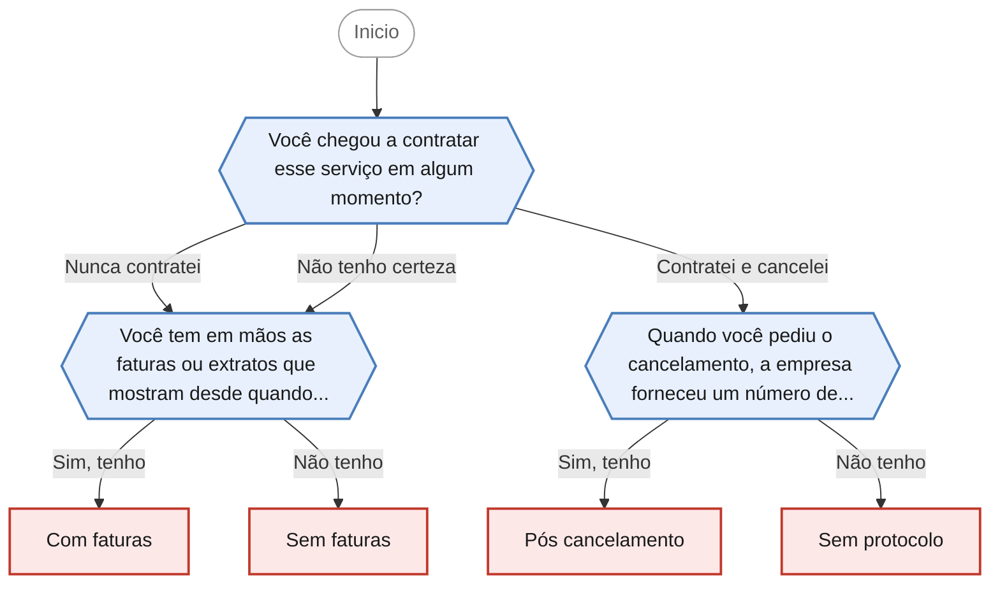
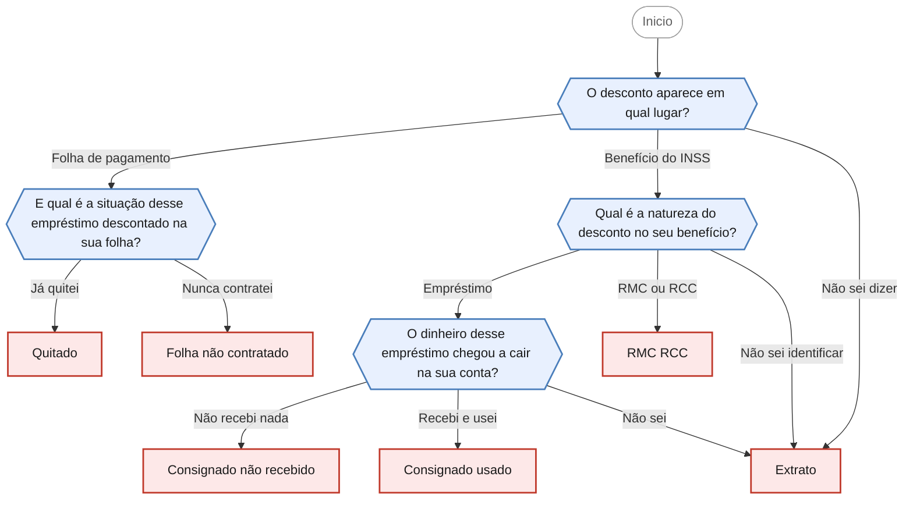
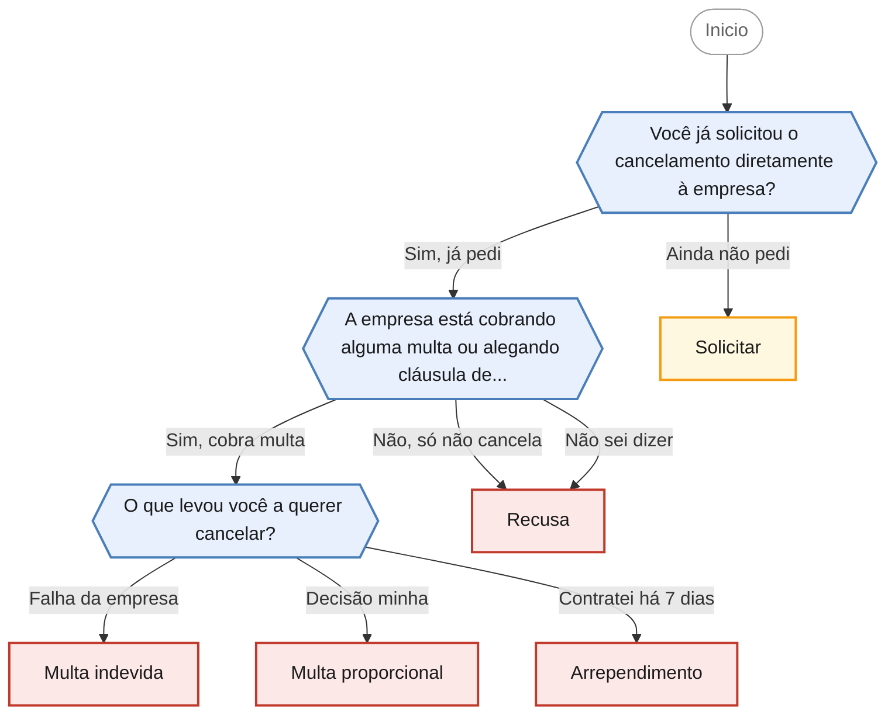
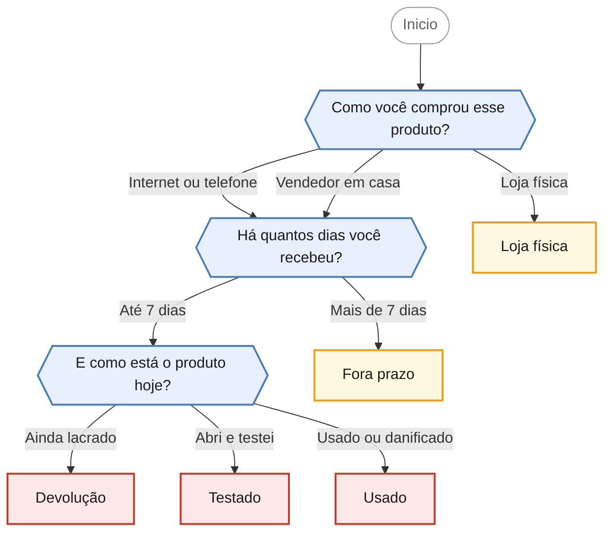
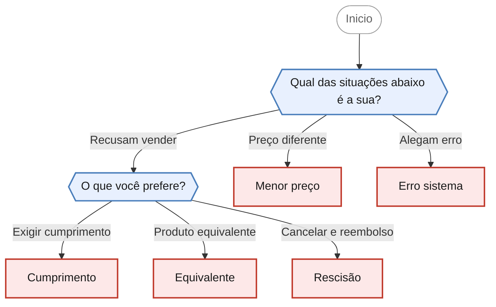
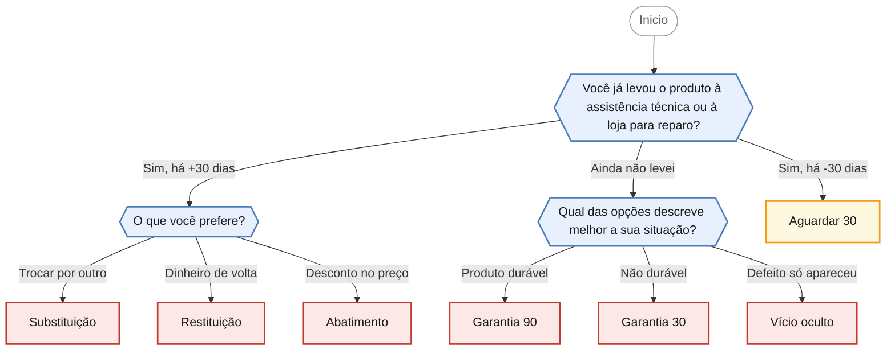
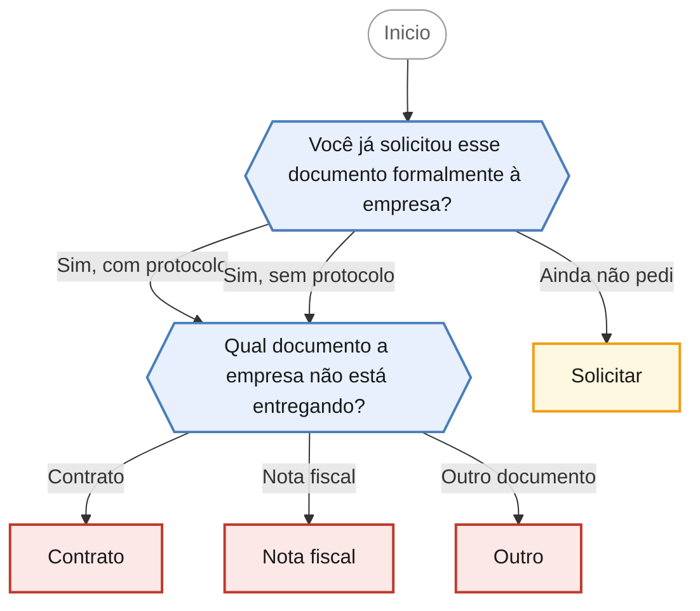

# Fluxogramas dos fluxos decisorios do PROCON

Diagramas gerados automaticamente a partir de `data/fluxos/*.json`.
Nao edite este arquivo a mao: altere o JSON e rode
`python3 scripts/gerar_diagramas.py`.

9 fluxos, 71 nos.

## Como ler os diagramas

| Forma | Significado |
|---|---|
| Hexagono azul | Pergunta ao cidadao. As setas sao as opcoes de resposta. |
| Retangulo vermelho | Orientacao final que encaminha para agendamento presencial. |
| Retangulo amarelo | Orientacao final apenas informativa. |
| Retangulo verde | Orientacao final que encaminha para o PROCON online. |
| Retangulo cinza | Assunto fora da competencia do PROCON. |

Cada caminho da raiz ate um retangulo e uma conversa completa possivel,
e serve como caso de teste para a frente de QA.

---

## Como funciona o atendimento do PROCON

`atendimento-procon` · Informações sobre abertura de reclamação, documentos exigidos, prazos de resposta e limites de atuação do PROCON.

**3 perguntas · 5 orientacoes finais** · Fonte: Dúvidas Frequentes PROCON Jacareí — casos 7, 8, 26, 27 e 47

Desfechos: Encaminha para agendamento presencial, Fora da competencia do PROCON, Apenas orienta.

O que cada desfecho responde

| Nó | Início da orientação | Encaminhamento |
|---|---|---|
| `orienta_documentos` | Cada caso exige uma análise própria, mas três documentos são sempre essenciais para abrir uma reclamação: o seu documento pessoal, o CNPJ da matriz do fornecedor e os comprovantes do problema. | Encaminha para agendamento presencial |
| `orienta_prazo` | Funciona assim: depois que a reclamação é aberta, chamada de CIP, o fornecedor tem até 10 dias corridos para apresentar a resposta no sistema. | Apenas orienta |
| `orienta_duplicidade` | Nesse caso não é possível abrir uma nova reclamação no posto de atendimento, porque não podemos registrar reclamações em duplicidade sobre o mesmo assunto. | Apenas orienta |
| `orienta_plataforma` | Sim, vale acionar os dois. | Encaminha para agendamento presencial |
| `orienta_imobiliario` | Preciso ser transparente: casos de direito imobiliário, como locação de imóveis, não são regidos pelo Código de Defesa do Consumidor. | Fora da competencia do PROCON |

---

## O produto não foi entregue no prazo

`atraso-entrega` · Fornecedor descumpre o prazo de entrega prometido. Consumidor escolhe entre cumprimento, produto equivalente ou rescisão.

**2 perguntas · 5 orientacoes finais** · Fonte: Dúvidas Frequentes PROCON Jacareí — caso 15

Desfechos: Encaminha para agendamento presencial, Apenas orienta.

O que cada desfecho responde

| Nó | Início da orientação | Encaminhamento |
|---|---|---|
| `orienta_cumprimento` | Você optou por exigir a entrega do produto que comprou. | Encaminha para agendamento presencial |
| `orienta_equivalente` | Você optou por aceitar outro produto ou serviço equivalente no lugar do que foi comprado. | Encaminha para agendamento presencial |
| `orienta_rescisao` | Você optou por cancelar a compra e receber o dinheiro de volta. | Encaminha para agendamento presencial |
| `orienta_aguardar` | Como o prazo prometido ainda não venceu, por ora não há descumprimento por parte da empresa e não é possível abrir uma reclamação por atraso. | Apenas orienta |
| `orienta_verificar_prazo` | Para saber se houve descumprimento, primeiro é preciso identificar qual prazo foi prometido. | Apenas orienta |

---

## Cobrança de serviço que eu não contratei

`cobranca-servico-nao-contratado` · Cobrança recorrente de serviço não contratado ou já cancelado, geralmente em fatura de cartão de crédito.

**3 perguntas · 4 orientacoes finais** · Fonte: Dúvidas Frequentes PROCON Jacareí — caso 1 (seguro no cartão de crédito)

Desfechos: Encaminha para agendamento presencial.

O que cada desfecho responde

| Nó | Início da orientação | Encaminhamento |
|---|---|---|
| `orienta_com_faturas` | Pelo que você descreveu, trata-se de uma cobrança por serviço não contratado. | Encaminha para agendamento presencial |
| `orienta_sem_faturas` | Pelo que você descreveu, trata-se de uma cobrança por serviço não contratado. | Encaminha para agendamento presencial |
| `orienta_pos_cancelamento` | Se o serviço foi cancelado e a cobrança continuou, os valores descontados depois do cancelamento também são indevidos. | Encaminha para agendamento presencial |
| `orienta_sem_protocolo` | Sem o número de protocolo fica mais difícil provar a data do seu pedido de cancelamento, mas isso não impede a reclamação. | Encaminha para agendamento presencial |

---

## Desconto indevido na folha de pagamento ou no benefício

`descontos-folha-beneficio` · Descontos de empréstimo já quitado, empréstimo não contratado ou reserva de margem (RMC/RCC) em folha ou benefício.

**4 perguntas · 6 orientacoes finais** · Fonte: Dúvidas Frequentes PROCON Jacareí — casos 2, 3 e 6

Desfechos: Encaminha para agendamento presencial.

O que cada desfecho responde

| Nó | Início da orientação | Encaminhamento |
|---|---|---|
| `orienta_quitado` | Se o empréstimo já foi quitado, os descontos que continuaram sendo feitos são indevidos. | Encaminha para agendamento presencial |
| `orienta_folha_nao_contratado` | Um empréstimo que você não contratou não pode ser descontado da sua folha. | Encaminha para agendamento presencial |
| `orienta_consignado_nao_recebido` | Se o valor nunca caiu na sua conta e mesmo assim há desconto no benefício, a situação é de empréstimo não reconhecido. | Encaminha para agendamento presencial |
| `orienta_consignado_usado` | Preciso ser transparente com você sobre esse ponto. | Encaminha para agendamento presencial |
| `orienta_rmc_rcc` | RMC e RCC são reservas de margem ligadas a um cartão de crédito consignado. | Encaminha para agendamento presencial |
| `orienta_extrato` | Para orientar você com precisão, primeiro é preciso identificar exatamente qual é o desconto. | Encaminha para agendamento presencial |

---

## Dificuldade para cancelar um serviço

`dificuldade-cancelamento` · Empresa dificulta ou recusa o cancelamento de serviço contratado, com ou sem cobrança de multa por fidelidade.

**3 perguntas · 5 orientacoes finais** · Fonte: Dúvidas Frequentes PROCON Jacareí — casos 5, 9 e 10

Desfechos: Encaminha para agendamento presencial, Apenas orienta.

O que cada desfecho responde

| Nó | Início da orientação | Encaminhamento |
|---|---|---|
| `orienta_solicitar` | Antes de abrir uma reclamação, o primeiro passo é registrar o pedido de cancelamento junto à empresa e guardar a prova disso. | Apenas orienta |
| `orienta_recusa` | A empresa não pode criar obstáculos para o cancelamento de um serviço que você contratou. | Encaminha para agendamento presencial |
| `orienta_multa_indevida` | Quando o cancelamento acontece porque a empresa falhou na prestação do serviço, a cobrança de multa por fidelidade é indevida. | Encaminha para agendamento presencial |
| `orienta_multa_proporcional` | Cláusula de fidelidade é permitida. | Encaminha para agendamento presencial |
| `orienta_arrependimento` | Se você contratou o serviço fora da loja física, por telefone, internet ou com vendedor em casa, e ainda está dentro dos 7 dias, existe um caminho mais simples: o direito de arrependimento. | Encaminha para agendamento presencial |

---

## Quero devolver uma compra da qual me arrependi

`direito-arrependimento` · Desistência de compra dentro de 7 dias, aplicável a contratações feitas fora do estabelecimento comercial.

**3 perguntas · 5 orientacoes finais** · Fonte: Dúvidas Frequentes PROCON Jacareí — casos 11 a 14, 23 e 43

Desfechos: Encaminha para agendamento presencial, Apenas orienta.

O que cada desfecho responde

| Nó | Início da orientação | Encaminhamento |
|---|---|---|
| `orienta_devolucao` | Você está dentro do prazo e tem direito de desistir da compra. | Encaminha para agendamento presencial |
| `orienta_testado` | Ter aberto a embalagem e testado o produto não elimina o seu direito de desistir. | Encaminha para agendamento presencial |
| `orienta_usado` | Aqui é preciso separar duas coisas. | Encaminha para agendamento presencial |
| `orienta_loja_fisica` | Preciso ser direto com você: o direito de arrependimento não se aplica a compras feitas presencialmente na loja. | Apenas orienta |
| `orienta_fora_prazo` | O prazo de 7 dias para desistir da compra já passou, então o direito de arrependimento não se aplica mais ao seu caso. | Apenas orienta |

---

## Problema com o preço anunciado

`divergencia-preco` · Divergência entre preço anunciado e cobrado, ou recusa da loja em cumprir a oferta divulgada.

**2 perguntas · 5 orientacoes finais** · Fonte: Dúvidas Frequentes PROCON Jacareí — casos 38 a 42

Desfechos: Encaminha para agendamento presencial.

O que cada desfecho responde

| Nó | Início da orientação | Encaminhamento |
|---|---|---|
| `orienta_menor_preco` | Quando há dois preços diferentes para o mesmo produto, vale o menor. | Encaminha para agendamento presencial |
| `orienta_cumprimento` | Você optou por exigir que a loja cumpra a oferta nos termos em que foi anunciada. | Encaminha para agendamento presencial |
| `orienta_equivalente` | Você optou por aceitar outro produto ou serviço equivalente no lugar do que foi anunciado. | Encaminha para agendamento presencial |
| `orienta_rescisao` | Você optou por cancelar a compra e receber o dinheiro de volta. | Encaminha para agendamento presencial |
| `orienta_erro_sistema` | Em regra, não. | Encaminha para agendamento presencial |

---

## Produto ou serviço com defeito (garantia)

`garantia-produto` · Produto ou serviço apresentou defeito. Trata prazos de garantia legal, vício oculto e as opções após 30 dias sem reparo.

**3 perguntas · 7 orientacoes finais** · Fonte: Dúvidas Frequentes PROCON Jacareí — casos 16 a 22, 28 a 37, 44 e 45

Desfechos: Encaminha para agendamento presencial, Apenas orienta.

O que cada desfecho responde

| Nó | Início da orientação | Encaminhamento |
|---|---|---|
| `orienta_aguardar_30` | O fornecedor tem até 30 dias para sanar o defeito. | Apenas orienta |
| `orienta_garantia_90` | Produtos duráveis, como eletrodomésticos, celulares, móveis e veículos, têm garantia legal de 90 dias, contados da entrega efetiva do produto. | Encaminha para agendamento presencial |
| `orienta_garantia_30` | Produtos e serviços não duráveis, como alimentos, serviços de estética e lavanderia, têm garantia legal de 30 dias, contados da entrega do produto ou da conclusão do serviço. | Encaminha para agendamento presencial |
| `orienta_vicio_oculto` | Quando o defeito não era visível no momento da compra e só apareceu com o uso, ele é chamado de vício oculto. | Encaminha para agendamento presencial |
| `orienta_substituicao` | Você optou pela substituição do produto por outro da mesma espécie, em perfeitas condições de uso. | Encaminha para agendamento presencial |
| `orienta_restituicao` | Você optou pela devolução do dinheiro. | Encaminha para agendamento presencial |
| `orienta_abatimento` | Você optou pelo abatimento proporcional do preço, ou seja, ficar com o produto e receber de volta parte do valor pago. | Encaminha para agendamento presencial |

---

## Empresa não entrega contrato ou nota fiscal

`recusa-entrega-documentos` · Fornecedor se recusa a entregar cópia do contrato, nota fiscal ou outro documento a que o consumidor tem direito.

**2 perguntas · 4 orientacoes finais** · Fonte: Dúvidas Frequentes PROCON Jacareí — casos 4 e 46

Desfechos: Encaminha para agendamento presencial, Apenas orienta.

O que cada desfecho responde

| Nó | Início da orientação | Encaminhamento |
|---|---|---|
| `orienta_solicitar` | O primeiro passo é solicitar o documento formalmente e guardar a prova do pedido. | Apenas orienta |
| `orienta_contrato` | O fornecedor é obrigado a entregar cópia do contrato. | Encaminha para agendamento presencial |
| `orienta_nota_fiscal` | Receber a nota fiscal é um direito seu. | Encaminha para agendamento presencial |
| `orienta_outro` | O direito à informação alcança os documentos ligados à sua relação de consumo: comprovantes, termos de garantia, extratos, demonstrativos e afins. | Encaminha para agendamento presencial |

---
