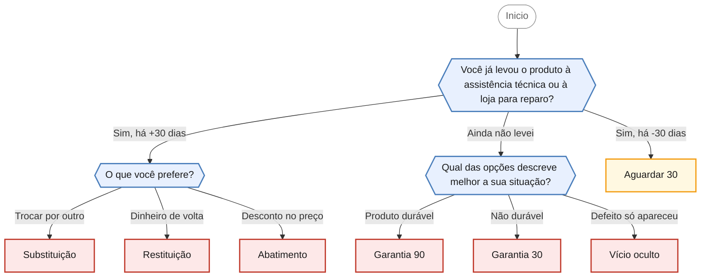

<!-- gerado por scripts/gerar_diagramas.py -->

## Produto ou serviço com defeito (garantia)

`garantia-produto` · Produto ou serviço apresentou defeito. Trata prazos de garantia legal, vício oculto e as opções após 30 dias sem reparo.

**3 perguntas · 7 orientacoes finais** · Fonte: Dúvidas Frequentes PROCON Jacareí — casos 16 a 22, 28 a 37, 44 e 45

Desfechos: Encaminha para agendamento presencial, Apenas orienta.

O que cada desfecho responde

| Nó | Início da orientação | Encaminhamento |
|---|---|---|
| `orienta_aguardar_30` | O fornecedor tem até 30 dias para sanar o defeito. | Apenas orienta |
| `orienta_garantia_90` | Produtos duráveis, como eletrodomésticos, celulares, móveis e veículos, têm garantia legal de 90 dias, contados da entrega efetiva do produto. | Encaminha para agendamento presencial |
| `orienta_garantia_30` | Produtos e serviços não duráveis, como alimentos, serviços de estética e lavanderia, têm garantia legal de 30 dias, contados da entrega do produto ou da conclusão do serviço. | Encaminha para agendamento presencial |
| `orienta_vicio_oculto` | Quando o defeito não era visível no momento da compra e só apareceu com o uso, ele é chamado de vício oculto. | Encaminha para agendamento presencial |
| `orienta_substituicao` | Você optou pela substituição do produto por outro da mesma espécie, em perfeitas condições de uso. | Encaminha para agendamento presencial |
| `orienta_restituicao` | Você optou pela devolução do dinheiro. | Encaminha para agendamento presencial |
| `orienta_abatimento` | Você optou pelo abatimento proporcional do preço, ou seja, ficar com o produto e receber de volta parte do valor pago. | Encaminha para agendamento presencial |

