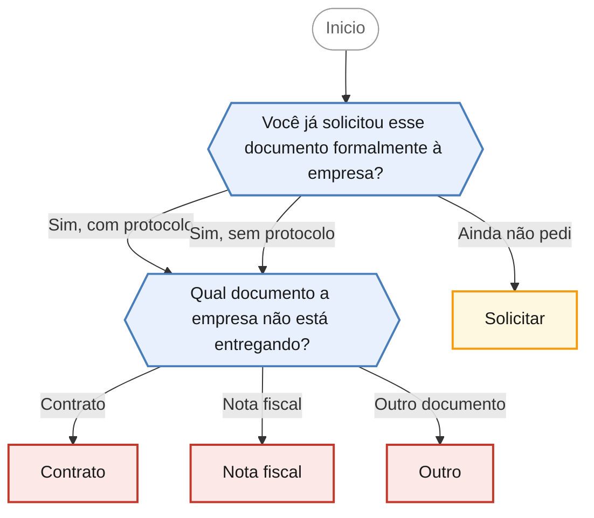

<!-- gerado por scripts/gerar_diagramas.py -->

## Empresa não entrega contrato ou nota fiscal

`recusa-entrega-documentos` · Fornecedor se recusa a entregar cópia do contrato, nota fiscal ou outro documento a que o consumidor tem direito.

**2 perguntas · 4 orientacoes finais** · Fonte: Dúvidas Frequentes PROCON Jacareí — casos 4 e 46

Desfechos: Encaminha para agendamento presencial, Apenas orienta.

O que cada desfecho responde

| Nó | Início da orientação | Encaminhamento |
|---|---|---|
| `orienta_solicitar` | O primeiro passo é solicitar o documento formalmente e guardar a prova do pedido. | Apenas orienta |
| `orienta_contrato` | O fornecedor é obrigado a entregar cópia do contrato. | Encaminha para agendamento presencial |
| `orienta_nota_fiscal` | Receber a nota fiscal é um direito seu. | Encaminha para agendamento presencial |
| `orienta_outro` | O direito à informação alcança os documentos ligados à sua relação de consumo: comprovantes, termos de garantia, extratos, demonstrativos e afins. | Encaminha para agendamento presencial |

